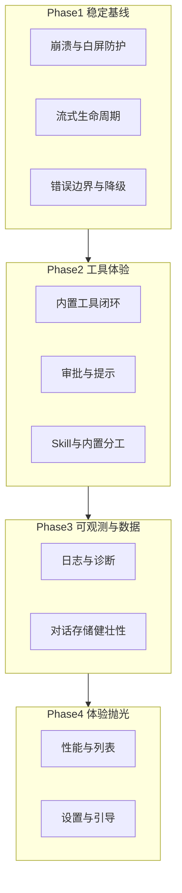

# PRD：Kivio Chat 功能完善与稳定性优化

| 字段 | 内容 |
|------|------|
| 文档版本 | v0.1 |
| 状态 | 草案 |
| 产品 | Kivio（桌面端，macOS / Windows） |
| 范围 | **Chat 模块**（`#chat` 路由、`main` 窗口）；不含 Lens 主流程改造 |
| 目标读者 | 产品、研发、测试 |
| 关联文档 | [CHAT_ARCHITECTURE.md](../CHAT_ARCHITECTURE.md) |

---

## 1. 背景与问题陈述

Kivio 已从「翻译 + 截图」演进为带 **Chat 客户端** 的桌面助手：多轮对话、流式输出、多 Provider、Skill/MCP、以及一批 **Kivio 内置工具**（读写文件、终端、Pyodioe、联网搜索/抓取）。

近期迭代快速落地了大量 Chat 能力，但暴露出三类缺口：

1. **功能体验未闭环**：内置工具已注册，但审批、错误提示、首启加载、与 Skill 的分工仍易让用户/模型「走错路」。
2. **稳定性风险**：白屏、流式中断、工具超时、端口/dev 环境不一致、对话 JSON 损坏等偶发问题影响信任。
3. **可维护性**：前后端契约分散（`chat-stream`、`chat-tool`、`chat-tool-confirm`、`chat-run-python`），缺少统一的回归清单与可观测性。

本 PRD 定义一版 **以「可用、可预期、可回归」为核心** 的 Chat 优化范围，不追求同期做大功能扩张。

---

## 2. 目标与非目标

### 2.1 产品目标

| 目标 | 说明 | 衡量方向 |
|------|------|----------|
| **G1 功能可预期** | 用户与模型能稳定选对内置工具 vs Skill vs MCP | 误激活 Skill 率下降、工具调用成功率上升 |
| **G2 交互稳定** | 少白屏、少卡死、流式可取消可恢复 | 崩溃/白屏反馈数、流式完成率 |
| **G3 工具可信** | 读写/终端/ Python 行为与安全策略透明 | 审批通过率、误操作投诉 |
| **G4 可发布** | 主分支可打包验证，变更可写 release note | 发版前冒烟通过率 |

### 2.2 非目标（本阶段不做）

- Lens 截图问答、截图翻译的流程与 UI 重构
- 全新大型能力（Agent 自主规划、多 Agent、代码索引/RAG 全库）
- 完整前端 E2E 自动化测试框架（仅预留关键路径手工 + 少量单测）
- 替换现有存储为 SQLite（保持「每对话一 JSON」方案）
- 在线协作、账号体系、云端同步

---

## 3. 用户与典型场景

| 角色 | 描述 | 核心诉求 |
|------|------|----------|
| 日常用户 | 热键打开 Chat，问问题、贴图、偶尔让 AI 改本地文件 | 快、别弹莫名其妙确认、别跑错 Skill |
|  power 用户 | 配置 MCP、安装 Skill、多 Provider | 工具列表准确、失败原因可读、设置集中 |
| 开发者自用 | 用 Chat 跑命令、读仓库、Python 草稿 | `run_python` / `run_command` 可靠，路径范围清晰 |

**高频场景（须优先保障）**

1. 新建对话 → 选模型 → 纯文本问答（流式）
2. 带图片附件提问（多模态 Provider）
3. 开启 `read_file` / `write_file`（写操作经审批）
4. 「使用 Python」→ `run_python`（非无关 Skill）
5. 开启 `web_search` / `web_fetch`（有/无 API Key 两种路径）
6. 侧栏切换对话、搜索、删除；设置中开关内置工具后工具列表更新
7. 流式过程中取消；切换对话不串台

---

## 4. 现状能力基线（As-Is）

### 4.1 已有能力

- 对话 CRUD、分页列表、流式 SSE（`chat-stream`）、思维链展示、工具调用块（`ToolCallBlock`）
- Skill 三件套 + MCP 服务器 + 内置工具（见 `ChatNativeToolsConfig`）
- 设置：MCP 页「Kivio 内置工具」、审批策略、工作区根目录（可选收紧至 home 子树）
- 附件图片预览、`ChatErrorBoundary` / `MarkdownErrorBoundary`
- Skill 过度引导已做第一轮修复（取消单 Skill 自动绑定、过滤时保留内置工具）

### 4.2 已知痛点（待本 PRD 消化）

| 编号 | 痛点 | 影响 |
|------|------|------|
| P1 | Pyodide 首次从 CDN 加载，慢/离线失败 | `run_python` 不可用 |
| P2 | 工具失败信息偏技术，用户难理解 | 信任下降 |
| P3 | 旧对话可能残留 `active_skill_id` 或历史上下文误导 | 仍走错 Skill |
| P4 | 流式/工具轮次多时报文大、取消不及时 | 卡顿、费用 |
| P5 | Provider 不支持 tools 时提示分散 | 配置成本高 |
| P6 | 无统一发版冒烟清单 | 回归漏测 |
| P7 | 对话 JSON 损坏时恢复策略弱 | 数据丢失感 |

---

## 5. 产品方案概览

优化分为 **四个主题域**，按阶段交付（见第 9 节）：

---

## 6. 功能需求

### 6.1 稳定性与容错（P0）

| ID | 需求 | 验收标准 |
|----|------|----------|
| ST-01 | 主 Chat 路由必须有错误边界包裹，Markdown/工具块局部失败不拖垮整页 | 人为注入 Markdown 异常仍可见侧栏与输入框 |
| ST-02 | 流式取消：用户点停止后 ≤1s 内停止增量并标记 cancelled | 不出现「取消后仍长时间追加字」 |
| ST-03 | 切换对话时中止旧 `conversationId` 的 stream/tool 事件 | 对话 A 的 delta 不出现在对话 B |
| ST-04 | `chat_send_message` 失败时回滚乐观 UI（用户消息可选保留并标失败） | 无「假发送成功」悬空状态 |
| ST-05 | Provider 缺失 Key / 模型名为空时，发送前拦截并给出可操作文案 | 跳转设置 Provider 的提示 |
| ST-06 | 工具调用全局超时与 `max_tool_rounds` 生效，超时返回明确错误 | 单轮工具卡死不阻塞整个应用 |

### 6.2 内置工具体验（P0–P1）

| ID | 需求 | 验收标准 |
|----|------|----------|
| TL-01 | **工具可见性**：设置开关与 `chat_mcp_list_tools` 一致，模型只见已启用工具 | 关闭 `run_command` 后 API tools 列表无该项 |
| TL-02 | **审批**：`write_file` / `edit_file` / `run_command` 在 `readonly_auto_sensitive_confirm` 下弹窗；展示 path/command 摘要 | 用户可拒绝且助手收到 skipped |
| TL-03 | **read_file / web_fetch / run_python / web_search** 默认不审批（可配置项后续再议） | 与 `sensitive` 标记一致 |
| TL-04 | **路径**：默认 home 子树；配置 `workspaceRoots` 后越界拒绝；错误中文可读 | 越界返回「不在允许路径」类文案 |
| TL-05 | **run_python**：首启显示加载态；失败区分网络/超时/语法错误 | 用户看到「正在加载 Python 环境…」 |
| TL-06 | **web_search**：无 Key 时不暴露工具或返回设置引导 | 与 Lens 共用 Key 配置 |
| TL-07 | **工具结果截断**：超长输出提示已截断，避免撑爆上下文 | 遵守 `maxToolOutputChars` |

### 6.3 Skill / MCP 分工（P1）

| ID | 需求 | 验收标准 |
|----|------|----------|
| SK-01 | 不因「仅一个 Skill」自动绑定；发消息不默认带 Skill id | 新对话说「使用 python」优先 `run_python` |
| SK-02 | Skill `allowed_tools` 过滤不得隐藏 Kivio 内置工具（`read_file`、`run_python` 等） | 激活 tavily Skill 后仍可调 `run_python` |
| SK-03 | System prompt / catalog 文案：Skill 可选，泛化任务优先内置工具 | 产品/运营可读的提示词规范入文档 |
| SK-04 | （可选）对话级「钉住 Skill」：仅用户显式开启时强制 `skill_activate` | 设置或对话菜单一项，默认关 |
| SK-05 | MCP 服务器失败时列出工具降级，不导致整轮对话失败 | 某 server 挂掉，其他工具仍可用 |

### 6.4 对话与 UI（P1–P2）

| ID | 需求 | 验收标准 |
|----|------|----------|
| UI-01 | 附件：图片内联预览，无多余文件名壳（已实现则回归） | 与产品视觉一致 |
| UI-02 | 工具块：友好中文名、来源显示 Kivio / Skill / MCP | `ToolCallBlock` 覆盖内置工具名 |
| UI-03 | 思维链：流式中折叠，工具后保持折叠，尾部预览 | 符合既有 UX 规范 |
| UI-04 | 侧栏：三点菜单与列表项对齐；搜索可用 | 视觉对齐 |
| UI-05 | 空状态 / 无 Provider：引导去设置 | 新用户可完成首次配置 |
| UI-06 | 长对话滚动与流式自动滚到底策略可预期 | 用户上滚阅读时不强拉到底（可选优化） |

### 6.5 设置与配置（P1）

| ID | 需求 | 验收标准 |
|----|------|----------|
| CF-01 | MCP 页集中管理内置工具 + 工作区根 + Chat 联网 API | 与 webSearch 页 Lens 开关分工清晰 |
| CF-02 | 修改内置工具开关后无需重启，下一轮发送生效 | 缓存 TTL 内刷新工具列表 |
| CF-03 | Chat 专用 Provider/模型与 Translator/Lens 独立记忆 | 切换设置保存成功 |

### 6.6 数据与存储（P2）

| ID | 需求 | 验收标准 |
|----|------|----------|
| DA-01 | 加载对话 JSON 失败时：单对话错误提示，不拖垮列表 | 列表仍可打开其他对话 |
| DA-02 | 保存失败重试一次并提示用户 | 无静默丢消息 |
| DA-03 | 附件路径校验（已在 Rust 层）+ 前端不展示不可读附件 | 安全基线保持 |

---

## 7. 非功能需求

| 类别 | 要求 |
|------|------|
| **性能** | 对话列表 50 条内首屏 &lt; 500ms（本地 SSD）；单文件 read ≤ 2MB |
| **安全** | 写/终端需审批；路径 home + 可选 roots；命令 denylist；`web_fetch` 仅 HTTPS |
| **隐私** | 对话与附件存本机 app data；工具不上传本地文件内容到 Kivio 服务器（仅用户配置的 Provider） |
| **兼容** | macOS 14+、Windows 10+；与现有 Tauri 双窗口（main/lens）共存 |
| **可维护性** | 新 Tauri 命令先进 `src/api/tauri.ts`；Rust 工具逻辑进 `native_tools/` / `mcp/registry.rs` |

---

## 8. 成功指标（建议）

| 指标 | 基线 | 目标（发版后 2 周） |
|------|------|---------------------|
| Chat 相关崩溃率 | 待埋点 | 较当前下降 50% |
| 流式完成率（非用户取消） | 待统计 | ≥ 95% |
| 工具调用一次成功率 | 待统计 | ≥ 90%（排除用户拒绝） |
| 「误激活 Skill」人工抽检 | 高 | 泛 Python 请求 ≥ 80% 走 `run_python` |
| 发版前冒烟 | 无清单 | P0 用例 100% 通过 |

---

## 9. 里程碑与优先级

### Phase 1 — 稳定基线（建议 1–1.5 周）

- ST-01 ~ ST-06  
- 流式/对话切换回归修复  
- 发版冒烟清单 v1（见附录 A）

**出口**：连续 3 天 dev 日常使用中无 P0 崩溃/白屏。

### Phase 2 — 工具体验闭环（1.5–2 周）

- TL-01 ~ TL-07（含 Pyodide 加载 UX）  
- SK-01 ~ SK-03（钉住 Skill 可放到 2.1）  
- UI-02、CF-01 ~ CF-02

**出口**：附录 A 中工具用例全部通过。

### Phase 3 — 可观测与数据（0.5–1 周）

- DA-01 ~ DA-02  
- 结构化日志：工具名、耗时、错误码（本地 log，可选设置页「复制诊断信息」）

### Phase 4 — 体验抛光（持续）

- UI-04 ~ UI-06、SK-04、SK-05  
- 性能：列表虚拟滚动（对话 &gt; 100 时）  
- Pyodide 离线包体方案调研（不强制实现）

---

## 10. 依赖与风险

| 风险 | 缓解 |
|------|------|
| Pyodide CDN 不可用 | 首启明确错误；Phase 4 评估本地 bundle |
| 模型乱调工具 | 提示词 + 工具描述精简；必要时减少默认开启工具数 |
| Provider tools 格式差异 | 保留 Anthropic/OpenAI 适配与 fallback 逻辑 |
| 主目录路径过宽 | 设置文案强调 workspaceRoots；写操作审批 |
| 范围膨胀 | 本 PRD 非目标明确；Phase 门禁 |

---

## 11. 开放问题

1. 是否在对话标题栏提供显式「钉住 Skill」？默认关还是记住上次？  
2. `run_python` 是否支持用户可选安装 numpy 等（micropip）还是固定标准库？  
3. 工具审批是否要做「本会话不再询问」？  
4. 是否需要导出对话（Markdown/JSON）作为稳定性外的轻量功能？  
5. 崩溃/诊断是否对接可选匿名上报（隐私合规）？

---

## 附录 A：发版前冒烟清单（Chat）

**环境**：`npm run dev` 或 release 包；至少一个支持 tools + vision 的 Provider 已配置。

- [ ] 冷启动打开 Chat，无白屏  
- [ ] 新建对话，流式问答，取消 mid-stream  
- [ ] 切换对话，无内容串台  
- [ ] 发送图片附件，预览正常  
- [ ] 开启 `read_file`，读取 home 下文本文件  
- [ ] 开启 `write_file`，出现审批，拒绝/通过各一次  
- [ ] 开启 `run_python`，`print(1+1)` 成功（允许首启等待）  
- [ ] 开启 `web_search`（有 Key）与 `web_fetch`（HTTPS URL）  
- [ ] 说「使用 python」不无故 `skill_activate` 无关 Skill  
- [ ] MCP 页关闭某内置工具后，下轮对话工具列表变化  
- [ ] 设置保存重启后配置仍在  
- [ ] Lens 热键与翻译热键仍正常（非回归 Chat 但必测）

---

## 附录 B：关键代码锚点（研发）

| 领域 | 路径 |
|------|------|
| 发送与流式 | `src-tauri/src/chat/commands.rs` |
| 工具注册/执行 | `src-tauri/src/mcp/registry.rs`, `native_tools/` |
| 设置 schema | `src-tauri/src/settings.rs` |
| 前端 Chat | `src/chat/Chat.tsx`, `InputBar.tsx`, `MessageList.tsx` |
| 契约 | `src/api/tauri.ts` |
| 设置 UI | `src/settings/SettingsShell.tsx`（MCP 内置工具） |

---

*文档结束。修订时请更新版本号与变更记录。*
